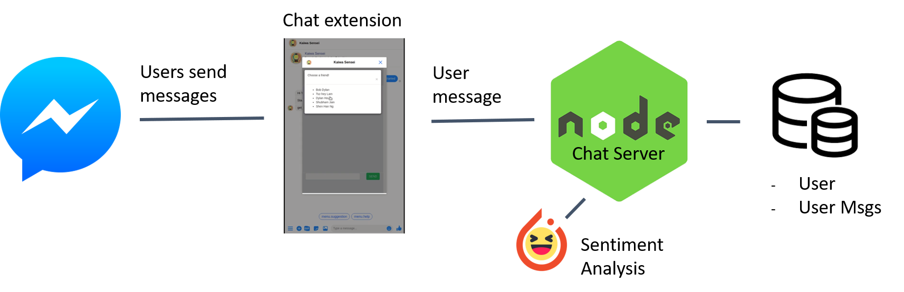

# Kaiwa Sensei

Kaiwa Sensei is a Sentiment Analysis Facebook Messenger bot that displays the conversation's mood during the conversation.

It was developed as part of the [Facebook Developer Circles London: Building Conversational AI for Messenger](https://facebook-dev-c-london.devpost.com/) Hackathon (07/12/19-08/12/19), by UCL students [Shubham](https://github.com/shu8), [Dylan](https://github.com/deCourier), [Tsz](https://github.com/gheylam), [Gabriel](https://github.com/Zaylar), [Ana](https://github.com/ak47na).

See the [DevPost](https://devpost.com/software/kaiwa-sensei-sentiment-analysis-of-messenger-messages) for more background on our project!

## Architecture

The project is split into 2 parts: a web chat interface and a Pytorch-backed ML model for the Sentiment Analysis.

The web chat interface and Messenger chat extension bot are developed in Node.JS and JavaScript.

The Sentiment Analysis is done in Python using Pytorch and [Deepmoji](https://deepmoji.mit.edu/). Note that the [Python/Pytorch implementation](https://github.com/huggingface/torchMoji/) library has been patched within this repo to make it work for the latest version of Python 3.

- The `./chat-webview` directory contains the client-side code for the chat application.
- The `./nlp-emotions` directory contains the patched version of TorchMoji.
  The `./nlp-emotions/examples/single_text_emotions.py` file contains the code used by the bot to determine a sentence's mood
- The `./word-datasets` directory contains word datasets used in the project

## How it works

The `./nlp-emotions/examples/single_text_emotions.py` Python script uses the emojis results to determine what the overall mood of a sentence is. The script returns a JSON string containing the fields `positive` (the positive words in the sentence), `negative` (the negative words in the sentence), `user_emotion` (`positive` and `negative`), and `main_vibe` (an emoji that describes the overall mood of the conversation).

The `index.js` file is the main server file that manages the Node.JS/Socket.IO HTTP server/websocket server for the client to talk to.

## Remarks

The code is not complete due to the nature of a Hackathon. It **should not** be used in production or sensitive environments. The bot will be disabled after the Hackathon so any tokens in the repo will be obsolete.
